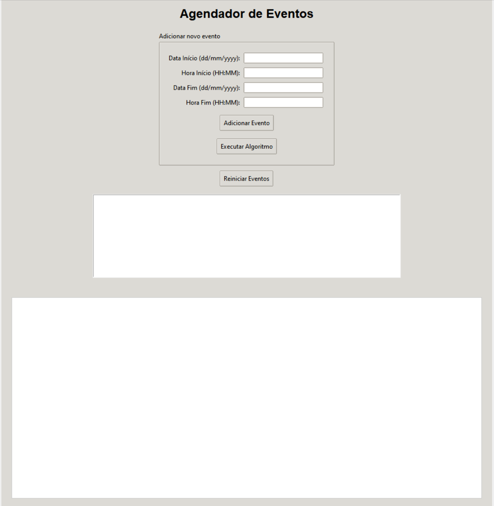
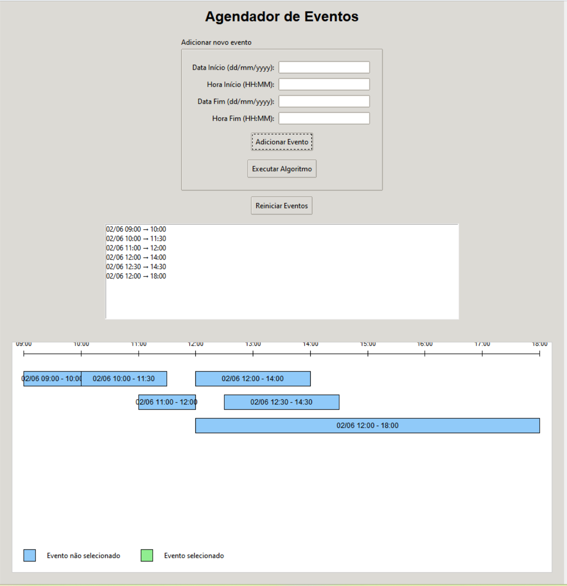
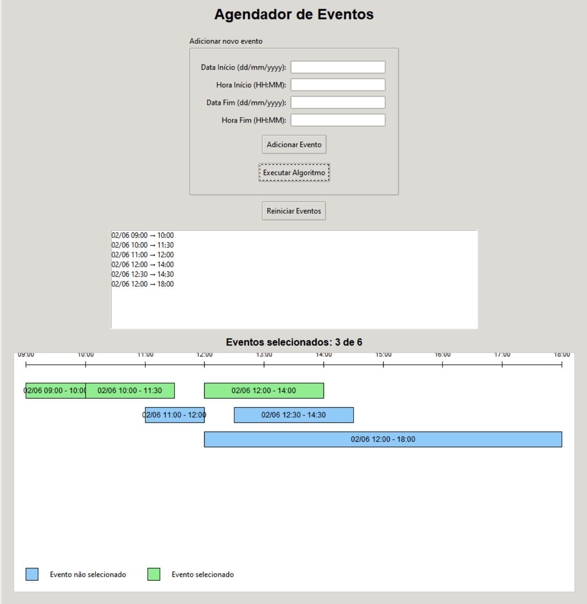

# **Mais Eventos**

### **Número do trabalho:** 3
### **Conteúdo da Disciplina:** Algoritmos Ambiciosos, Interval Scheduling

### **Alunos**

| Matrícula   | Aluno                                       |
|-------------|---------------------------------------------|
| 190033011   |  Luana Souza Silva Torres          |
| 211045196   | Suzane Alves Duarte        |

## **Vídeo de Apresentação**

No link abaixo é possível ver o vídeo de apresentação do projeto com mais detalhes:

[Link para apresentação](https://youtu.be/qL8toYkx9Jk)

## **Sobre**

Este projeto consiste em uma aplicação interativa desenvolvida em Python que simula um organizador de tarefas levando em consideração seu horário. 

A aplicação tem como objetivo encontrar o número máximo de tarefas que o usuário pode realizar de acordo com as tarefas cadastradas utilizando o algoritmo de Interval Scheduling — um algoritmo ganancioso que seleciona o maior subconjunto de atividades não sobrepostas.

Além disso, o sistema conta com uma interface gráfica intuitiva onde:

- Os eventos são exibidos graficamente em uma linha do tempo.
- Os eventos selecionados pelo algoritmo são destacados em cor diferente.
- Há uma legenda explicativa das cores e uma linha do tempo com marcações de horário.

## Objetivos do Projeto
- Aplicar conceitos de teoria dos algortimos ambicioso em um cenário visual e interativo.
- Permitir ao usuário adicionar eventos com data e horário específicos.
- Exibir os eventos de forma gráfica, destacando os eventos que fazem parte da melhor seleção.
- Proporcionar uma ferramenta interativa para entendimento de algoritmos ambiciosos.


## **Screenshots**

A seguir, são apresentados screenshots do projeto em funcionamento. 

Primeiramente, a tela inicial do jogo:

 

Tela com eventos adicionados pelo usuário: 

  

Tela após executar o algortimo: 

 


## **Instalação**

- **Linguagem:** Python  
- **Bibliotecas:** `tkinter` (interface gráfica) e `datetime (manipulação de datas e horários).

### **Pré-requisitos:**  

Você precisa apenas do Python instalado (recomendado a partir da versão 3.8), pois o tkinter e o datetime já vêm embutidos nas principais instalações. 

Se você estiver utilizando Ubuntu/Debian/Linux para verificar se o tkinter está instalado abra um terminal e rode:

```bash
python3 -m tkinter
```

Se abrir uma janelinha com "This is a Tcl/Tk..." então está tudo certo! Se der erro, use:

```bash
sudo apt install python3-tk
``` 

No caso do Windows ele já vem instalado com o Python, então: 

**Como executar o jogo:**
```bash
python3 main.py
```


## **Uso**

1. Execute a aplicação com o comando acima.

2. Aguarde a tela inicial e preencha os campos com a data e hora de início e data e hora de fim de cada evento.

3. Clique em *Adicionar Evento* para inserir o evento na lista.

4. Após adicionar todos os eventos desejados, clique em *Executar Algoritmo*.

5. O sistema exibirá a melhor seleção de eventos (máximo de eventos sem sobreposição) em verde claro com a linha do tempo exibindo a distribuição dos eventos com os horários cadastrados.

6. Para reiniciar a lista de eventos, clique em *Reiniciar Eventos*.

## **Outros**

- Cores:

    - Azul Claro:  Evento não selecionado.

    - Verde claro: Evento selecionado (faz parte da solução ótima).

    - Linha do tempo horizontal: Exibe as marcações de horário.

    - Legenda: Demonstra ao usuário os eventos selecionados e não selecionados pelo algoritmo.

- Sobre o Algoritmo:

    - O algoritmo de Interval Scheduling ordena os eventos pelo horário de término e seleciona aqueles que não conflitam com eventos já escolhidos.

    - Garante o subconjunto máximo de eventos possíveis sem sobreposição.
